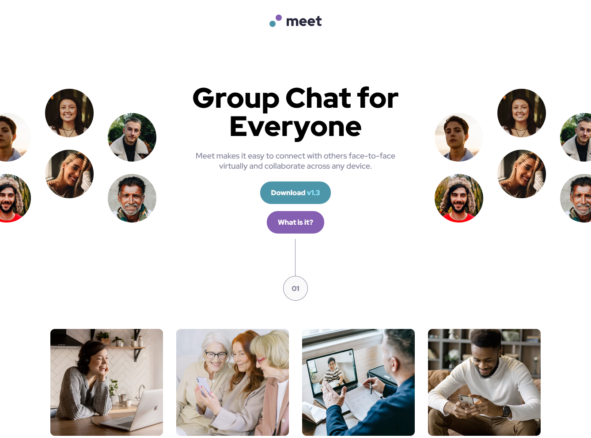

# Meet Landing Page

This is a solution to the [Meet landing page challenge on Frontend Mentor](https://www.frontendmentor.io/challenges/meet-landing-page-rbTDS6OUR). Frontend Mentor challenges help to improve coding skills by building realistic projects. Frontend Mentor provides design specifications and assets, all code is written by me.

### Screenshot

### Links

- Link to Solution [Github](https://github.com/kennyputman/meet-landing-page)
- Live Site [Link](https://kennyputman.github.io/meet-landing-page/)

### Built with

Just plain old html and css.
